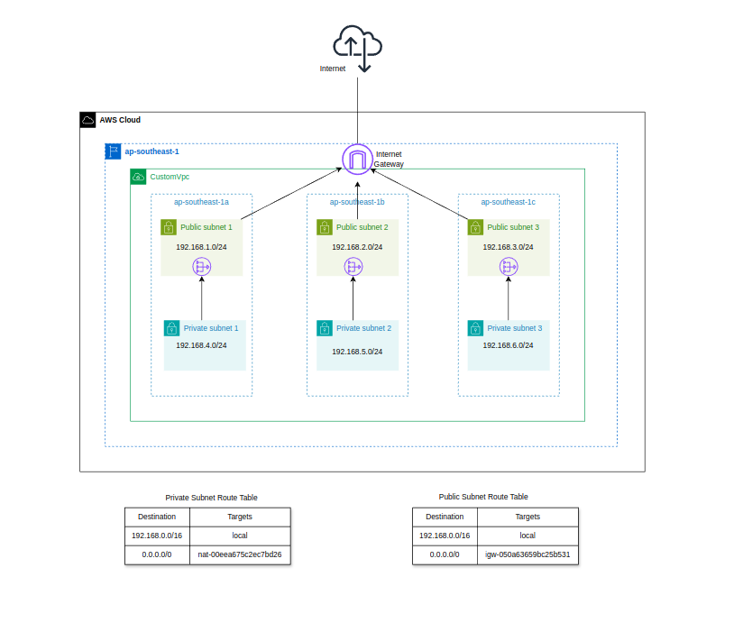

# Create a Custom VPC with Private Subnets and Private Subnets using AWS Cloud Formation 


## Table of Contents 
* [Architecture](#architecture)
* [Components](#components)
* [Useful Commands](#useful-commands)
* [Step 1. Create Custom VPC and Internet Gateway](#step-1-create-custom-vpc-and-internet-gateway)
* [Step 2. Create Public Subnets, Public Route Table, and Associate with Public Subnet](#step-2-create-public-subnets-public-route-table-and-associate-with-public-subnet)
* [Step 3. Create Private Route Tables](#step-3-create-private-route-tables)
* [Step 4. Create Private Subnets and Associate Route Table](#step-4-create-private-subnets-and-associate-route-table)
* [Step 5. Create NAT Gateway, Elastic IP, and Attach Private Route Table to NAT Gateway](#step-5-create-nat-gateway-elastic-ip-and-attach-private-route-table-to-nat-gateway)
* [Verify](#verify)
---

## Architechure

---



## Components that we are going to create

---

- Custom VPC
- Internet Gateway
- 3 Public subnets
- Custom route table for the public subnet
- Internet Gateway attached to the private subnet
- 3 Private subnets
- Custom route tables for the private subnet
- NAT Gateway attached to the private subnet

## Useful Command

---

**Create Stack**

`aws cloudformation create-stack --stack-name <stack-name> --template-body file://<your_cf_filename>  --profile <awscli_profilename>`

**Update Stack**

`aws cloudformation update-stack --stack-name <stack-name> --template-body file://<your_cf_filename>  --profile <awscli_profilename>`

**Delete Stack**

`aws cloudformation delete-stack --stack-name <stack-name> --profile <awscli_profilename>`

## Let’s started!

### Step 1. Create Custom VPC and Internet Gateway

---

We start create **Custom VPC** and using CidrBlock `192.168.0.0/16`

```yaml
AWSTemplateFormatVersion: "2010-09-09"
Description: 'Public Subnets in ap-southeast-1 Custom VPC'
Resources:
  CustomVpc:
    Type: AWS::EC2::VPC
    Properties:
      CidrBlock: '192.168.0.0/16'
      EnableDnsHostnames: true
      EnableDnsSupport: true
      InstanceTenancy: default
      Tags: 
        - Key : "Name"
          Value: "CustomVpc"
```

We need to Create an **Internet Gateway**. If there is no igw, then there is no connection between VPC and Internet

```yaml
  CustomVpcIGW:
    Type: AWS::EC2::InternetGateway
    Properties:
      Tags: 
        - Key : "Name"
          Value: "CustomVpc IGW"
```

Finally, **attach IGW to VPC**

```yaml
  AttachCustomVPCandIGW:
    Type: AWS::EC2::VPCGatewayAttachment
    Properties:
      InternetGatewayId: 
        !Ref CustomVpcIGW
      VpcId: 
        !Ref CustomVpc
```

### Step 2. Create public subnets, public route table and associate with public subnet

---

Create 3 public subnets

```yaml
# Public Subnet

  publicSubnet1:
    Type : AWS::EC2::Subnet
    Properties: 
      AvailabilityZone : "ap-southeast-1a"
      CidrBlock : "192.168.1.0/24" 
      MapPublicIpOnLaunch : true
      Tags : 
        - Key : "Name"
          Value : "public-Subnet1"
      VpcId : 
        !Ref CustomVpc
    

  publicSubnet2:
    Type : AWS::EC2::Subnet
    Properties: 
      AvailabilityZone : "ap-southeast-1b"
      CidrBlock : "192.168.2.0/24" 
      MapPublicIpOnLaunch : true
      Tags : 
        - Key : "Name"
          Value : "public-Subnet2"
      VpcId : 
        !Ref CustomVpc

  publicSubnet3:
    Type : AWS::EC2::Subnet
    Properties: 
      AvailabilityZone : "ap-southeast-1c"
      CidrBlock : "192.168.3.0/24" 
      MapPublicIpOnLaunch : true
      Tags : 
        - Key : "Name"
          Value : "public-Subnet3"
      VpcId : 
        !Ref CustomVpc
```

Create **public route table**

```yaml
  CustomVpcRouteTable:
    Type: AWS::EC2::RouteTable
    Properties:
      VpcId: 
        !Ref CustomVpc
      Tags:
        - Key: "Name"
          Value: "CustomVpc Route Table"
```

Attach **route table to IGW**

```yaml
  defaultRouteTabletoIGW:
    Type: AWS::EC2::Route
    Properties:
      DestinationCidrBlock: '0.0.0.0/0'
      GatewayId:
        !Ref CustomVpcIGW
      RouteTableId: 
        !Ref CustomVpcRouteTable
```

Associate with public subnets

```yaml
  publicSubnet1RTAssociation: 
    Type: AWS::EC2::SubnetRouteTableAssociation
    Properties:
      RouteTableId: 
        !Ref CustomVpcRouteTable
      SubnetId: 
        !Ref publicSubnet1
   
  publicSubnet2RTAssociation:
    Type: AWS::EC2::SubnetRouteTableAssociation
    Properties:
      RouteTableId: 
        !Ref CustomVpcRouteTable
      SubnetId: 
        !Ref publicSubnet2
     
  publicSubnet3RTAssociation:    # RT association for public subnet3
    Type: AWS::EC2::SubnetRouteTableAssociation
    Properties:
      RouteTableId: 
        !Ref CustomVpcRouteTable
      SubnetId: 
        !Ref publicSubnet3
```

### Step 3. Create private route tables

---

Create **private route table**

```yaml
  RouteTableForprivateSubnet1:    # Route table for private subnet1
    Type: AWS::EC2::RouteTable
    Properties:
      VpcId:  
        !Ref CustomVpc
      Tags:
      - Key: "Name"
        Value: "route table for privateSubnet1"
    
  RouteTableForprivateSubnet2:    # Route table for private subnet2
    Type: AWS::EC2::RouteTable
    Properties:
      VpcId:  
        !Ref CustomVpc
      Tags:
      - Key: "Name"
        Value: "route table for privateSubnet2"
     
  RouteTableForprivateSubnet3:    #Route table for private subnet3
    Type: AWS::EC2::RouteTable
    Properties:
      VpcId:  
        !Ref CustomVpc
      Tags:
      - Key: "Name"
        Value: "route table for privateSubnet3"
```

### Step 4. Create private subnets and associate route table

---

Create **3 private subnets**

```yaml
  privateSubnet1:
    Type : AWS::EC2::Subnet
    Properties: 
      AvailabilityZone : "ap-southeast-1a"
      CidrBlock : "192.168.4.0/24" 
      MapPublicIpOnLaunch : false
      Tags : 
        - Key : "Name"
          Value : "privateSubnet1"
      VpcId : 
        !Ref CustomVpc

  privateSubnet2:
    Type : AWS::EC2::Subnet
    Properties: 
      AvailabilityZone : "ap-southeast-1b"
      CidrBlock : "192.168.5.0/24"  
      MapPublicIpOnLaunch : false
      Tags : 
        - Key : "Name"
          Value : "privateSubnet2"
      VpcId : 
        !Ref CustomVpc
        
  privateSubnet3:
    Type : AWS::EC2::Subnet
    Properties: 
      AvailabilityZone : "ap-southeast-1c"
      CidrBlock : "192.168.6.0/24"
      MapPublicIpOnLaunch : false
      Tags : 
        - Key : "Name"
          Value : "privateSubnet3"
      VpcId : 
        !Ref CustomVpc
```

Associate route table with private subnets

```yaml
  privateSubnet1RTAssociation:    # RT association for private subnet1
    Type: AWS::EC2::SubnetRouteTableAssociation
    Properties:
      RouteTableId: 
        !Ref RouteTableForprivateSubnet1
      SubnetId: 
        !Ref privateSubnet1
        
  privateSubnet2RTAssociation:    # RT association for private subnet2
    Type: AWS::EC2::SubnetRouteTableAssociation
    Properties:
      RouteTableId: 
        !Ref RouteTableForprivateSubnet2
      SubnetId: 
        !Ref privateSubnet2
        
  privateSubnet3RTAssociation:    # RT association for private subnet3
    Type: AWS::EC2::SubnetRouteTableAssociation
    Properties:
      RouteTableId: 
        !Ref RouteTableForprivateSubnet3
      SubnetId: 
        !Ref privateSubnet3
```

### Step 5. Create NAT Gateway, Elastic IP and attach private route table to NAT Gateway

---

We need to create **Elastic IP** to associate with NAT Gateway. We created 3 ElP not to single point of failture.

```yaml
  NatGwEIP1:
    Type: AWS::EC2::EIP
    Properties:
      Domain: 'vpc'
      Tags: 
        - Key : "Name"
          Value: "NAT Gateway EIP 1"

  NatGwEIP2:
    Type: AWS::EC2::EIP
    Properties:
      Domain: 'vpc'
      Tags: 
        - Key : "Name"
          Value: "NAT Gateway EIP 2"

  NatGwEIP3:
    Type: AWS::EC2::EIP
    Properties:
      Domain: 'vpc'
      Tags: 
        - Key : "Name"
          Value: "NAT Gateway EIP 3"
```

Create **NAT Gateway**

```yaml
  NatGateway1:
    Type: AWS::EC2::NatGateway
    Properties:
      AllocationId:
        !GetAtt NatGwEIP1.AllocationId
      ConnectivityType: 'public'
      SubnetId:
        !Ref privateSubnet1
      Tags: 
        - Key : "Name"
          Value : "NatGateway1"

  NatGateway2:
    Type: AWS::EC2::NatGateway
    Properties:
      AllocationId:
        !GetAtt NatGwEIP2.AllocationId
      ConnectivityType: 'public'
      SubnetId:
        !Ref privateSubnet2
      Tags: 
        - Key : "Name"
          Value : "NatGateway2"

  NatGateway3:
    Type: AWS::EC2::NatGateway
    Properties:
      AllocationId:
        !GetAtt NatGwEIP3.AllocationId
      ConnectivityType: 'public'
      SubnetId:
        !Ref privateSubnet3
      Tags: 
        - Key : "Name"
          Value : "NatGateway3"
```

Attach **Private route table to NAT Gateway**

```yaml
  privateSubnet1NATGatewayRoute: # Route for NAT Gateway in private subnet1
    Type: AWS::EC2::Route
    Properties:
      RouteTableId: !Ref RouteTableForprivateSubnet1
      DestinationCidrBlock: '0.0.0.0/0'
      NatGatewayId: !Ref NatGateway1
      
  privateSubnet2NATGatewayRoute: # Route for NAT Gateway in private subnet1
    Type: AWS::EC2::Route
    Properties:
      RouteTableId: !Ref RouteTableForprivateSubnet2
      DestinationCidrBlock: '0.0.0.0/0'
      NatGatewayId: !Ref NatGateway2
      
  privateSubnet3ATGatewayRoute: # Route for NAT Gateway in private subnet1
    Type: AWS::EC2::Route
    Properties:
      RouteTableId: !Ref RouteTableForprivateSubnet3
      DestinationCidrBlock: '0.0.0.0/0'
      NatGatewayId: !Ref NatGateway3
```

## Verify

---

**CloudFormation Stack**


**VPC and Route tables**

